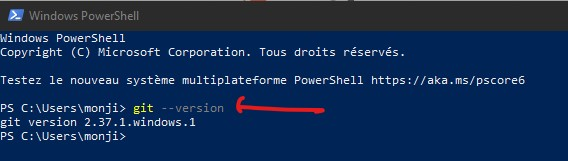
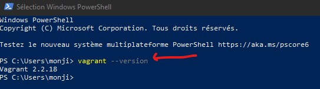
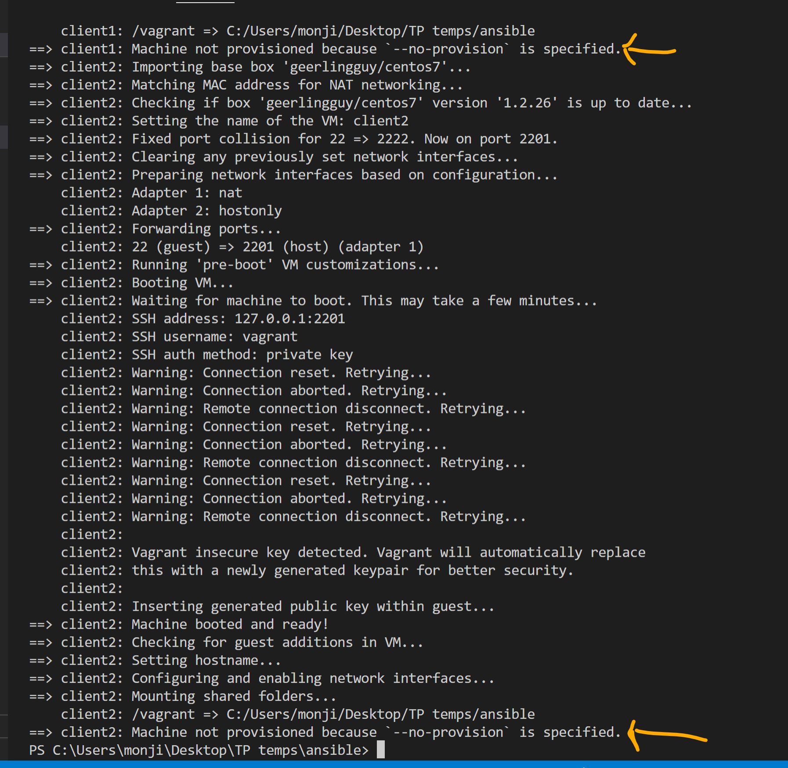
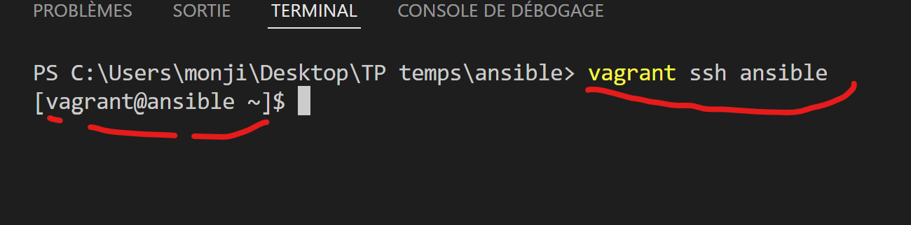

# TP0 - Déploiement du labs

--- 
## Description 

Il est question d'utiliser l'outil Vagrant pour automatiser le déploiement des VMs (**Centos 7**) dans virtualbox.
2 ou 3 Machines virtuelles (VMs) seront suffisantes pour suivre ce programme.

--- 


### Prérequis

Les outils [git](https://git-scm.com/download/win), [virtualbox](https://www.virtualbox.org/wiki/Downloads) et [vagrant](https://developer.hashicorp.com/vagrant/downloads) doivent être installé sur votre poste de travail. L'installation qui va suivre est faite sur un poste de travail **Windows 10**.

#### Téléchargement et installation des outils

###### git
Télécharger l'exécutable de git [ici](https://git-scm.com/download/win) et lancer l'assistant d'installation.

###### virtualbox
Télécharger l'exécutable de virtualbox [ici](https://download.virtualbox.org/virtualbox/6.1.26/VirtualBox-6.1.26-145957-Win.exe) et lancer l'assistant d'installation.
    

###### vagrant
Télécharger l'exécutable de vagrant [ici](https://releases.hashicorp.com/vagrant/2.2.18/vagrant_2.2.18_x86_64.msi) et lancer l'assistant d'installation. A la fin de l'installation, vous devez redémarrer votre poste de travail afin de finaliser le processus d'installation.

#### Vérification de l'installation
###### git
git est un outils qui s'utilise en **ligne de commande**. Du coup, sur votre poste de travail windows, il faudrait ouvrir un terminal **powershell** et taper la commande ```git --version```. Le résultat devrait ressembler à ceci :

###### virtualbox
Il faut juste lancer le programme et vérifier qu'il démarre proprement.
###### vagrant
Tout comme git, vagrant s'utilise en **ligne de commande**. Du coup, sur votre terminal **powershell**, taper la commande ```vagrant --version```. Le résultat devrait ressembler à ceci :



---
:warning:
- L'outil vagrant rencontre parfois des erreurs au lancement. Ces erreurs sont souvent liées à une dépendance de version entre **vagrant** et **virtualbox**.
- Du coup, pensez bien à utiliser ***les dernières versions de ces outils***. 
- A toute fin utile, sur le PC servant d'exemple, les versions suivantes de vagrant et virtualbox sont utilisées.
  - vagrant : **2.2.18**
  - virtualbox : **6.1.26**.

---


#### Création du répertoire de travail sur votre poste de travail.
Tout se passe en ligne de commande.
1. Téléchargez [le repos git suivant](https://github.com/diranetafen/cursus-devops.git) et déplacez vous dans ce répertoire.
    ```
    PS C:\Users\monji\Desktop> git clone https://github.com/diranetafen/cursus-devops.git
    PS C:\Users\monji\Desktop> cd cursus-devops
    PS C:\Users\monji\Desktop\cursus-devops>
    ```
2. Dans ce répertoire, déplacez vous dans le répertoire vagrant, puis ansible.
    ```
    PS C:\Users\monji\Desktop> cd .\vagrant\ansible\
    PS C:\Users\monji\Desktop\cursus-devops\vagrant\ansible
    ```
#### Création des Machines virtuelles dans virtualbox
1. Lancer la création des VMs dans virtualbox à l'aide de la commande ```vagrant up --no-provision```. l'option **--provision** permet de désactiver l'installation d'ansible par vagrant. En effet, les VMs seront créée, et nous allons installer ansible par nos propres soins, manuellement.
    ```
    PS C:\Users\monji\Desktop\cursus-devops\vagrant\ansible> vagrant up --no-provision
    ```
    Le processus de création des VMs devrait se mettre en oeuvre. Il va durer une dizaine de minutes en fonction de la qualité de votre connexion internet.    
 
La fin de l'exécution devrait ressembler à ceci :
 

Une fois le déploiement terminé, on aura deux (ou trois) VMs dans Virtualbox comme suit :

- La Machine **ansible** correspond au serveur sur lequel on va installer ansible
- **client1** et **client2** correspondent aux machines qui seront pilotées par ansible. En théorie on ne devrait jamais ***directement*** se connecter  sur ces serveurs clients.

#### Connexion aux machines virtuelles.
Les machines ont respectivement pour adresses IP :

|Machines        |adresses IP                    |
|----------------|-------------------------------|
|ansible         |`192.168.99.10`                |
|client1         |`192.168.99.11`                |
|client2         |`192.168.99.12`                |

Les informations d'identification sont : 
- utilisateur: **vagrant**
- mot de pass: **vagrant**
Du coup, deux méthodes de connexion possibles : 

1. Via la commande **ssh** 
    ```
    PS C:\Users\monji\Desktop\cursus-devops\vagrant\ansible> ssh vagrant@192.168.99.10
    ```
2. Via la commande **vagrant**
   
   A condition de se trouver dans le répertoire **cursus-devops\vagrant\ansible**. 
   Ci dessous le résultat attendu.

    ```
    PS C:\Users\monji\Desktop\cursus-devops\vagrant\ansible> vagrant ssh ansible
    ```    
    
